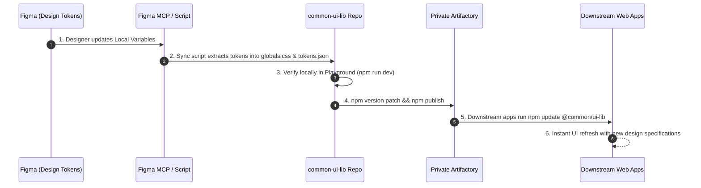

# Standard Operating Procedure (SOP): Common UI Library Publishing & Downstream Integration

> **Scope**: This document defines the standard procedures for building, versioning, and publishing the `@common/ui-lib` package to a private NPM registry (e.g., JFrog Artifactory, GitHub Packages, or Nexus), as well as integrating and consuming its Design Tokens and UI components in downstream frontend applications.

---

## Table of Contents
1. [Prerequisites & Authentication Setup](#1-prerequisites--authentication-setup)
2. [Publishing Procedure (Upstream Library)](#2-publishing-procedure-upstream-library)
3. [Downstream Project Integration (Consumer Applications)](#3-downstream-project-integration-consumer-applications)
4. [Figma-to-Code Iteration Lifecycle](#4-figma-to-code-iteration-lifecycle)
5. [CI/CD Pipeline Reference](#5-cicd-pipeline-reference)
6. [Troubleshooting & FAQ](#6-troubleshooting--faq)

---

## 1. Prerequisites & Authentication Setup

Before publishing or installing packages from a private registry, your environment must be authenticated.

### 1.1 Configure `.npmrc`
Create or configure `.npmrc` in the root of `common-ui-lib` (and similarly in consuming consumer projects):

```ini
# Map the @common scope to your internal Artifactory repository
@common:registry=https://your-company.artifactory.com/api/npm/npm-virtual/

# Inject authentication token securely via environment variables (DO NOT commit raw tokens)
//your-company.artifactory.com/api/npm/npm-virtual/:_authToken=${NPM_TOKEN}
```

> **Local Developer Alternative**:
> Authenticate interactively via the terminal:
> ```bash
> npm login --registry=https://your-company.artifactory.com/api/npm/npm-virtual/
> ```
> Enter your Artifactory username, API Key / Password, and email when prompted.

---

## 2. Publishing Procedure (Upstream Library)

Follow these steps sequentially to publish a new release of `@common/ui-lib`.

### Step 1: Type Checking & Library Build
In the `common-ui-lib` directory:
```bash
# Compile TypeScript declarations and bundle ESM/CJS assets
npm run build
```
**Verification Checklist**:
- Ensure the build exits with status code `0` and no TypeScript diagnostics errors.
- Verify that the `dist/` directory contains:
  - `dist/index.js` (bundled ESM entry)
  - `dist/index.d.ts` (complete TypeScript type definitions)
  - `dist/tokens/*` (tokens and preset exports)

### Step 2: Semantic Version Bump (SemVer)
Update the version according to the scope of your changes:
```bash
# Patch release: Bug fixes, minor token tweaks, or styling corrections
npm version patch   # 0.1.0 -> 0.1.1

# Minor release: New components (e.g., Calendar, Dialog), new chart primitives
npm version minor   # 0.1.0 -> 0.2.0

# Major release: Breaking API changes or token schema refactoring
npm version major   # 0.1.0 -> 1.0.0
```

### Step 3: Publish to Private Registry
```bash
# Publish using your preconfigured .npmrc settings
npm publish

# Or explicitly define the target registry:
npm publish --registry=https://your-company.artifactory.com/api/npm/npm-virtual/
```
Verify on your Artifactory web interface that `@common/ui-lib` displays the newly published version.

---

## 3. Downstream Project Integration (Consumer Applications)

Follow these three essential steps in any new or existing frontend application (Vite, Next.js, Remix, etc.).

### Step 1: Install Dependencies
Ensure your consumer project has access to your private registry via `.npmrc`, then run:
```bash
npm install @common/ui-lib
```

> **Recommended Peer Dependencies**:
> If not already installed, install standard styling and icon dependencies:
> ```bash
> npm install lucide-react clsx tailwind-merge class-variance-authority
> ```

### Step 2: Configure Tailwind CSS (`tailwind.config.ts`)
Update `tailwind.config.ts` (or `.js`) with two critical adjustments:
1. **Extend Theme Presets**: Import `commonUIPreset` so all CSS variable color mappings (`--primary`, `--chart-1` to `5`, `--bullish`, `--radius`) are available.
2. **Add Content Scan Path**: Include `@common/ui-lib/dist` in Tailwind's `content` array so Tailwind extracts classes used inside library components.

```ts
import type { Config } from "tailwindcss";
import { commonUIPreset } from "@common/ui-lib/tailwind-preset";

const config: Config = {
  // 1. Inherit design tokens preset matching Figma Variables
  presets: [commonUIPreset],

  content: [
    // Application source files
    "./index.html",
    "./src/**/*.{js,ts,jsx,tsx}",

    // 2. CRITICAL: Allow Tailwind to scan bundled component classes
    "./node_modules/@common/ui-lib/dist/**/*.{js,mjs}",
  ],
  theme: {
    extend: {
      // App-specific theme extensions here (if needed)
    },
  },
  plugins: [],
};

export default config;
```

### Step 3: Import Global Design Token Variables
In your root application stylesheet (e.g., `src/index.css` or `src/globals.css`), import the library variables at the very top:

```css
/* 1. Import Design Tokens (:root and .dark variables) */
@import "@common/ui-lib/globals.css";

/* 2. Standard Tailwind layers */
@tailwind base;
@tailwind components;
@tailwind utilities;
```

### Step 4: Import and Use Components
Import components directly into your application views:

```tsx
import React from "react";
import {
  Logo,
  Button,
  Dialog,
  DialogTrigger,
  DialogContent,
  DialogHeader,
  DialogTitle,
  DialogDescription,
  PortfolioPerformanceChart,
  AssetHoldingsTable,
} from "@common/ui-lib";

export function PortfolioDashboard() {
  return (
    <div className="p-8 space-y-6 max-w-7xl mx-auto">
      {/* Brand Logo Header */}
      <div className="flex items-center justify-between">
        <Logo size="md" brandName="FinancePro" />

        {/* Modal Dialog */}
        <Dialog>
          <DialogTrigger asChild>
            <Button>Rebalance Portfolio</Button>
          </DialogTrigger>
          <DialogContent>
            <DialogHeader>
              <DialogTitle>Rebalance Confirmation</DialogTitle>
              <DialogDescription>
                Automated buy and sell orders will execute to achieve target weights.
              </DialogDescription>
            </DialogHeader>
          </DialogContent>
        </Dialog>
      </div>

      {/* Financial Portfolio Area Chart (Bound to --chart-1 through --chart-5) */}
      <PortfolioPerformanceChart />

      {/* Asset Holdings Table (Supports sorting & bullish/bearish badges) */}
      <AssetHoldingsTable />
    </div>
  );
}
```

---

## 4. Figma-to-Code Iteration Lifecycle

When designers adjust colors, radii, or component properties in Figma, follow this operational loop:



1. **Figma Update**: Designers modify colors or metrics in the Figma Local Variables panel.
2. **Automated Sync**: Set `FIGMA_PERSONAL_ACCESS_TOKEN` in `.env` (using `.env.example`), then run `npm run sync:figma`.
3. **Local Validation**: Run `npm run storybook` in `common-ui-lib` to inspect the changes across all components.
4. **Publish**: Run `npm version patch && npm publish`.
5. **Downstream Update**: Consuming applications execute `npm update @common/ui-lib`.

---

## 5. CI/CD Pipeline Reference

To automate publishing on merges to `main`, use this GitHub Actions / GitLab CI workflow:

### GitHub Actions Workflow (`.github/workflows/publish.yml`)
```yaml
name: Publish to Private Registry

on:
  push:
    branches:
      - main

jobs:
  publish:
    runs-on: ubuntu-latest
    steps:
      - name: Checkout repository
        uses: actions/checkout@v4

      - name: Setup Node.js
        uses: actions/setup-node@v4
        with:
          node-version: '20'
          registry-url: 'https://your-company.artifactory.com/api/npm/npm-virtual/'

      - name: Install dependencies
        run: npm ci

      - name: Build library and types
        run: npm run build

      - name: Publish package
        run: npm publish
        env:
          NODE_AUTH_TOKEN: ${{ secrets.ARTIFACTORY_NPM_TOKEN }}
```

---

## 6. Troubleshooting & FAQ

### Q1: Components render without background colors or styles in the downstream app.
- **Root Cause**: Tailwind CSS did not scan the component source in `node_modules`.
- **Solution**: Check `tailwind.config.ts` in your application. Ensure `content` contains `"./node_modules/@common/ui-lib/dist/**/*.{js,mjs}"` and `presets: [commonUIPreset]` is declared.

### Q2: Dark mode is toggled, but colors do not switch.
- **Root Cause**: Missing CSS variable definitions.
- **Solution**: Confirm that `@import "@common/ui-lib/globals.css";` is present at the very top of your global CSS stylesheet.

### Q3: `npm publish` fails with `401 Unauthorized` or `403 Forbidden`.
- **Root Cause**: Missing or expired auth token in `.npmrc`, or incorrect scope permissions.
- **Solution**: Re-authenticate using `npm login --registry=...` or generate a fresh API Token from Artifactory User Profile.

### Q4: TypeScript complains `Cannot find module '@common/ui-lib' or its corresponding type declarations`.
- **Root Cause**: The library was published without running `npm run build`, or type definitions were omitted.
- **Solution**: Check that `dist/index.d.ts` exists before running `npm publish`.
